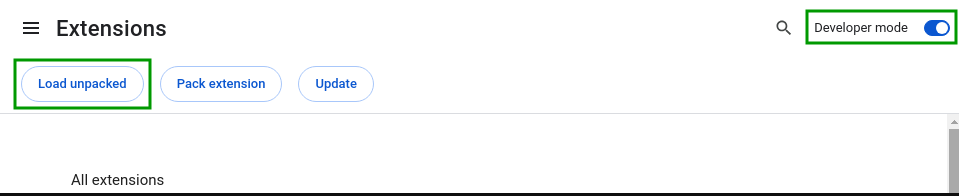
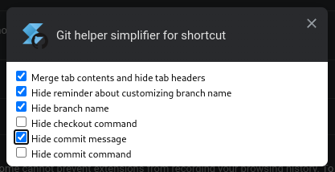
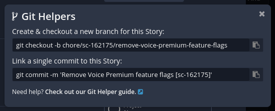

# Chrome extension - Git helper simplifier for shortcut

Simplify the git helper panel in shortcut - fully configurable

## Usage
- Clone the repo
- Turn on Developer mode in chrome://extensions/
- Load as an unpacked extension
- Click "Details" on the extension, then "Extension options"
- Configure how you like
- Enjoy

